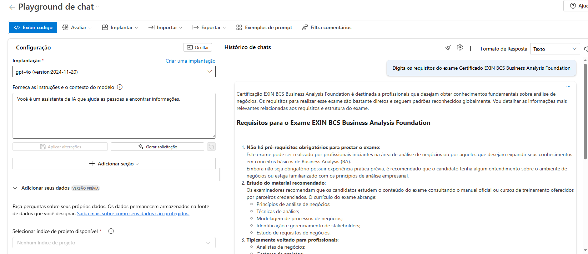
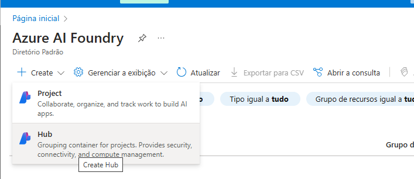
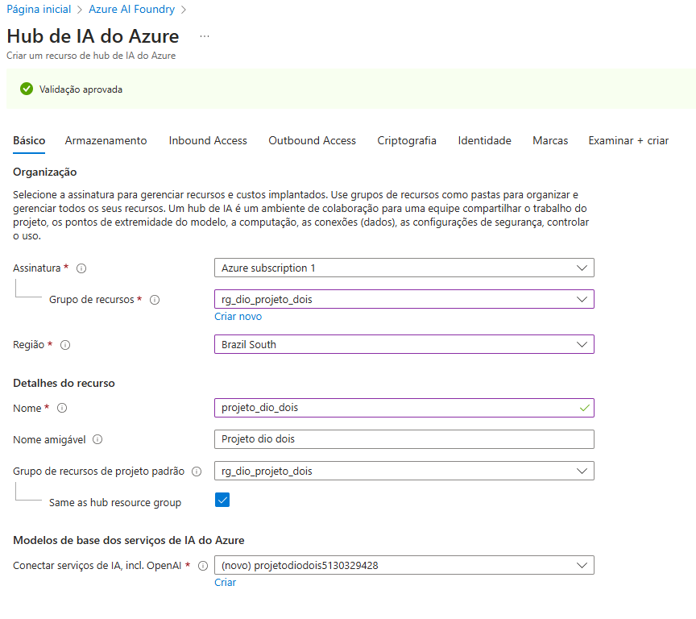
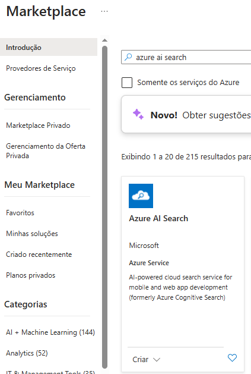
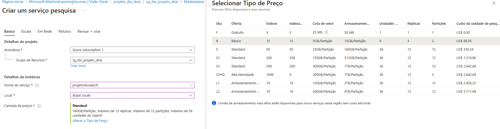
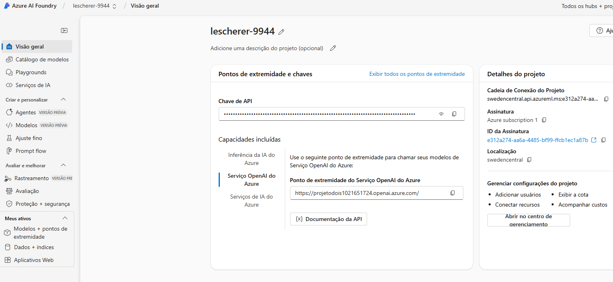
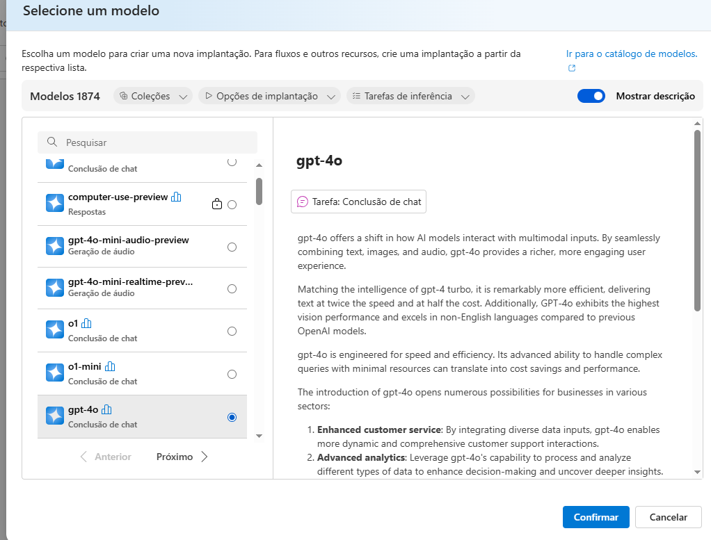
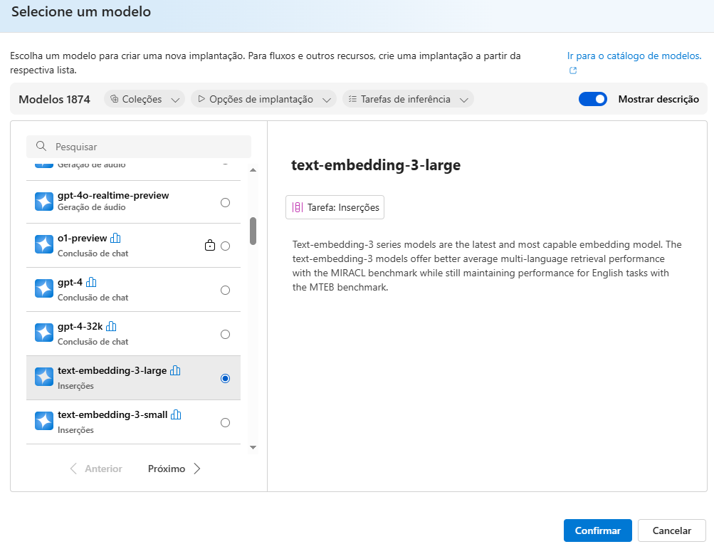
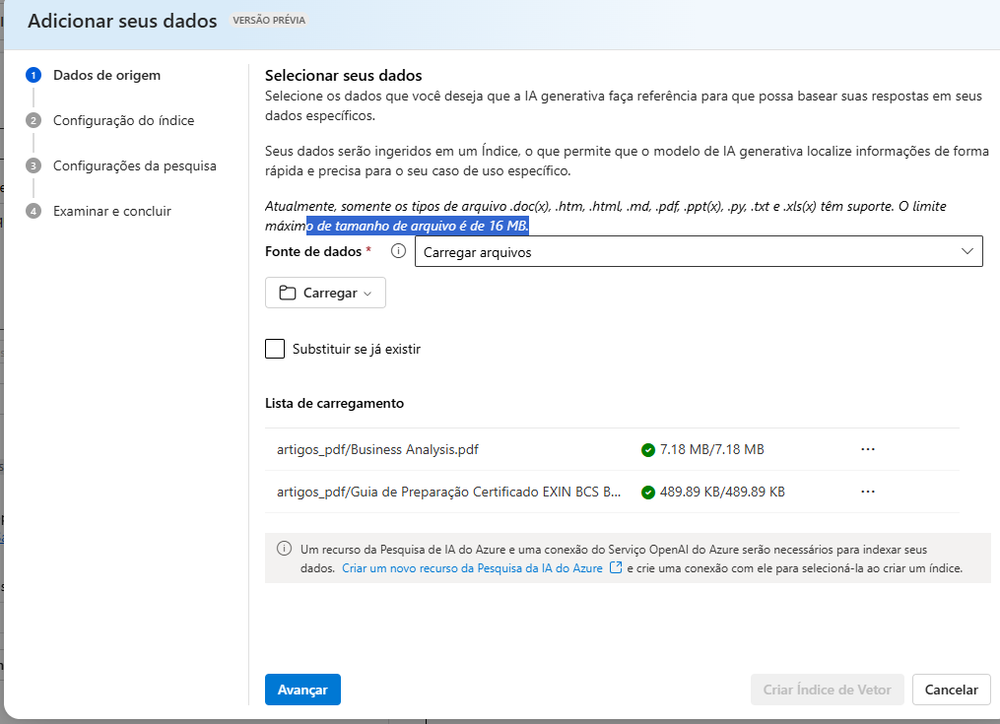

# 📚 Chatbot Inteligente para PDFs com Azure AI Foundry

Este projeto consiste em um chatbot interativo que responde perguntas com base no conteúdo de documentos PDF. Ele utiliza inteligência artificial generativa, embeddings e buscas vetorizadas para estruturar um sistema capaz de entender, processar e fornecer respostas relevantes baseadas em documentos carregados pelo usuário.

---

## 🚀 Visão Geral

Imagine que você está estudando para uma certificação e possui diversos artigos e guias em PDF. Encontrar informações relevantes nesses arquivos pode ser uma tarefa desafiadora. Este chatbot resolve esse problema permitindo buscas inteligentes nos PDFs e respondendo perguntas de forma contextualizada.

---

## 🎯 Objetivos

- Permitir o upload de arquivos PDF contendo informações relevantes para estudo.
- Implementar um sistema de busca vetorial para indexar e recuperar informações de forma eficiente.
- Utilizar IA para gerar respostas contextuais baseadas no conteúdo dos documentos carregados.
- Criar uma interface interativa para perguntas e respostas.

---

## 🛠️ Tecnologia Utilizada

- **Azure AI Foundry** - Para construção do chatbot com IA generativa.

---

## 📌 Limitação do projeto

- Devido a limitação do meu plano na plataforma Azure, consegui fazer apenas uma pergunta para o chatbot.

    

---

## 🖼️ Prints da Aplicação

    
    

    
    

    
    

    
    

    
    

    
    

