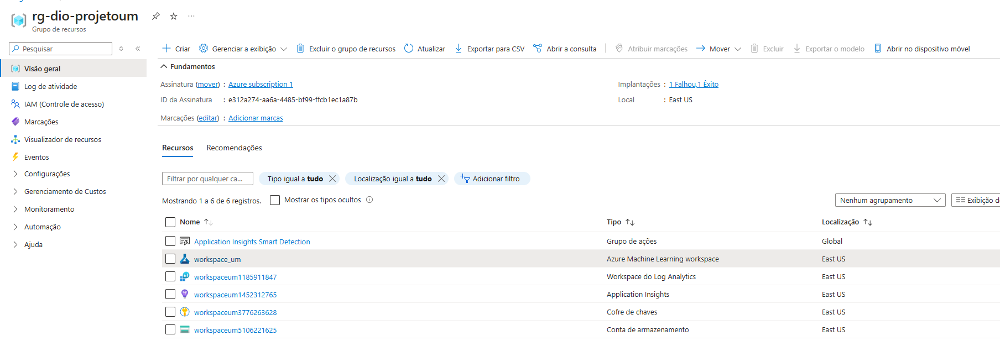
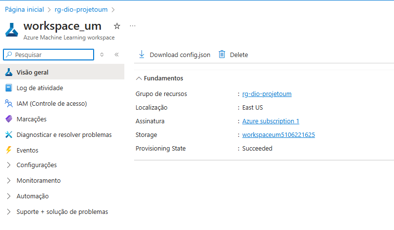
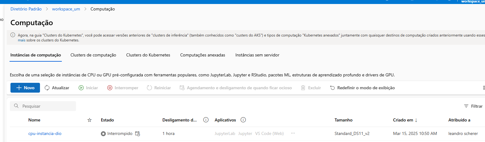
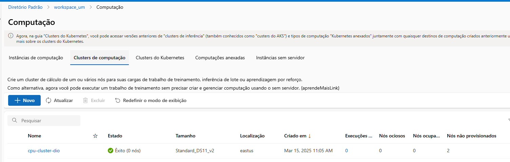
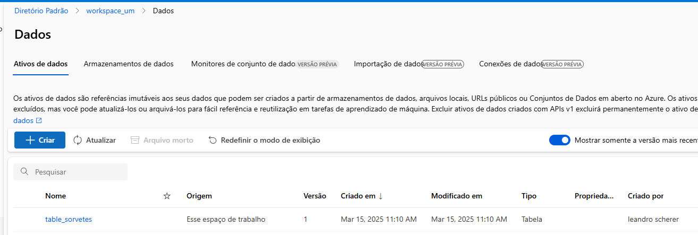
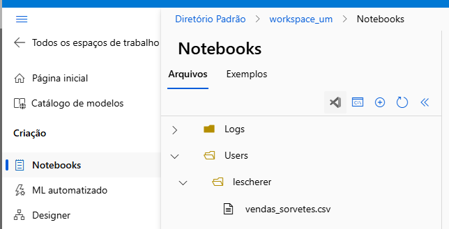
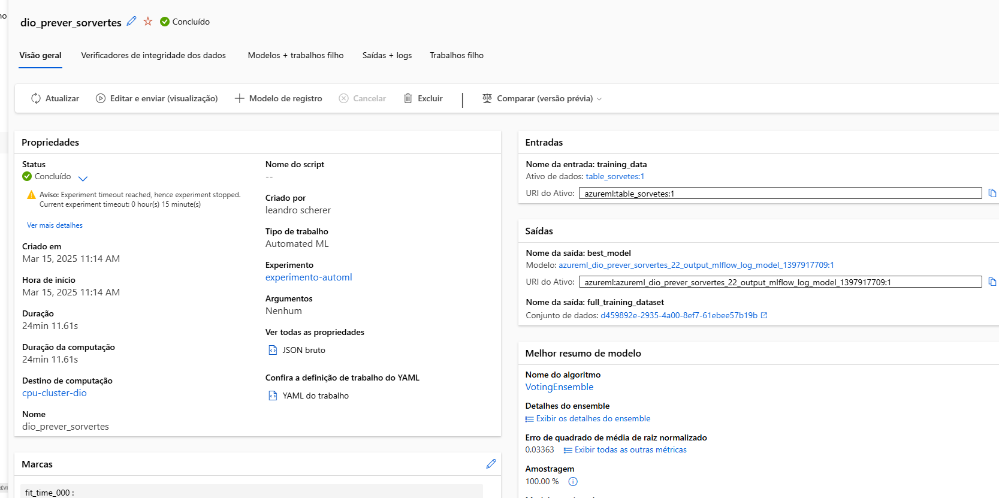
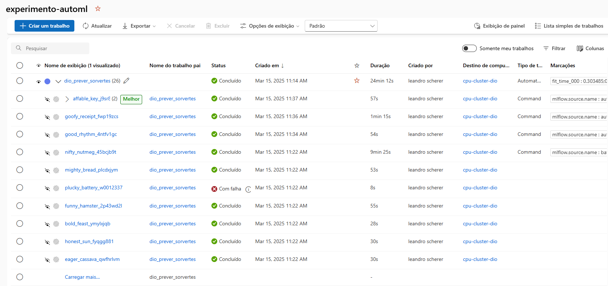
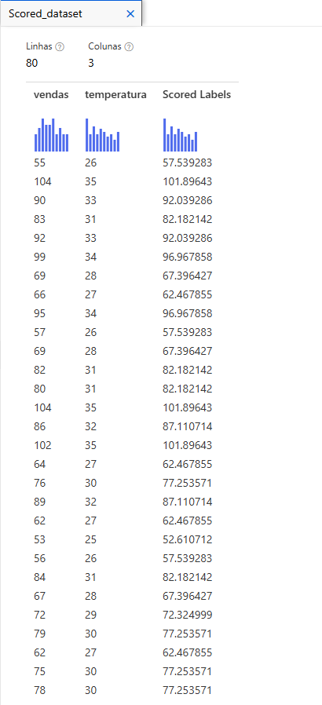

# 📌 Previsão de Vendas de Sorvetes com Azure Machine Learning

## Descrição

Este projeto tem como objetivo desenvolver um modelo de regressão preditiva para prever as vendas de sorvetes com base na temperatura do dia, utilizando o Azure Machine Learning. O modelo visa auxiliar donos de sorveterias a otimizar a produção, reduzindo desperdícios e maximizando lucros.

## Etapas do Projeto

1.  **Configuração do Ambiente Azure Machine Learning:**
    * Criação de um grupo de recursos chamado "rg-dio-projetoum".
    * Criação de um workspace chamado "workspace\_um".
    * Em "Gerenciar" -> "Computação", criação de uma instância de computação chamada "cpu-instancia-dio" e um cluster de computação chamado "cpu-cluster-dio".
      

    
    

    
    

2.  **Importação e Preparação dos Dados:**
    * Importação do arquivo "vendas\_sorvetes.csv" para o ambiente de notebooks do Azure Machine Learning.
    * Criação da tabela "table\_sorvetes" a partir dos dados importados, excluindo a coluna de data.
  

    
    

3.  **Treinamento do Modelo com AutoML:**
    * Utilização do modelo de regressão automatizada do Azure Machine Learning (AutoML) para treinar o algoritmo.
    * **Análise dos Resultados (Captura de Tela):**
        * A imagem anexada mostra as métricas de desempenho do modelo treinado.
        * **Métricas Principais:**
            * **Explained Variance:** 0.9854973 (indica que o modelo explica 98.55% da variância nos dados).
            * **R² Score:** 0.9834966 (indica um excelente ajuste do modelo aos dados).
            * **Mean Absolute Error (MAE):** 1.677034 (o erro médio absoluto das previsões é de aproximadamente 1.68 unidades de vendas).
            * **Root Mean Squared Error (RMSE):** 1.917058 (o erro médio quadrático das previsões é de aproximadamente 1.92 unidades de vendas).
        * **Gráficos:**
            * **Predicted vs. True:** O gráfico mostra a relação entre os valores previstos e os valores reais, com uma linha ideal indicando um ajuste perfeito. A dispersão dos pontos próximos à linha ideal sugere um bom desempenho do modelo.
            * **Residuals Histogram:** O histograma dos resíduos mostra a distribuição dos erros de previsão. Uma distribuição próxima da normalidade e centrada em zero indica que o modelo não possui viés significativo.
        * **Conclusão:**
            * Os resultados indicam que o modelo de regressão treinado com AutoML apresenta um excelente desempenho na previsão de vendas de sorvetes com base na temperatura.

    
    

       

4.  **Criação do Pipeline:**
   

       

**Objetivo:**

* Criação de um pipeline para estudo e experimentação, visando automatizar o fluxo de trabalho de Machine Learning e avaliar o desempenho do modelo de regressão linear.

**Componentes do Pipeline:**

* **Import Data:**
    * Importação da tabela "table\_sorvetes" para o pipeline.
* **Select Columns:**
    * Seleção das colunas relevantes ("vendas" e "temperatura") para o treinamento do modelo.
* **Split Data:**
    * Divisão dos dados em conjuntos de treinamento e teste.
    * Utilização de uma fração de 0.2 para o conjunto de teste (20% dos dados), conforme indicado na primeira saída do componente.
* **Train Model:**
    * Treinamento do modelo de regressão linear utilizando o conjunto de treinamento.
    * A coluna "vendas" foi definida como a variável alvo (label) para o treinamento.
* **Score Model:**
    * Aplicação do modelo treinado ao conjunto de teste para gerar previsões.
    * A tabela "Scored dataset" anexada mostra os resultados da previsão.

**Análise dos Resultados (Scored dataset):**

* A tabela "Scored dataset" mostra os valores reais de "vendas", "temperatura" e as previsões geradas pelo modelo ("Scored Labels").

       

**Observações:**

* **Precisão das Previsões:** Os valores previstos ("Scored Labels") são bastante próximos dos valores reais de "vendas", indicando um bom desempenho do modelo de regressão linear.
* **Exemplo:**
    * Para a linha com "vendas" = 104 e "temperatura" = 35, o modelo previu 101.89643.
    * Para a linha com "vendas" = 55 e "temperatura" = 26, o modelo previu 57.539283.
* **Conclusão:** O modelo de regressão linear conseguiu capturar a relação entre a temperatura e as vendas de sorvetes com boa precisão.

## Próximos Passos

* Explorar a adição de outras variáveis ao modelo, como dia da semana, feriados ou eventos especiais.
* Testar outros algoritmos de regressão para comparar o desempenho.
* Implementar uma interface de usuário para facilitar a utilização do modelo por donos de sorveterias.
* Desenvolver um sistema de alerta para notificar os donos de sorveterias sobre previsões de alta demanda.

