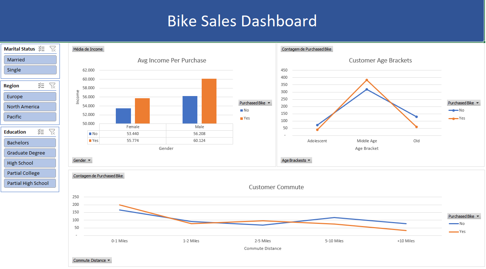

# Análise de Vendas de Bicicletas - Excel

  

## Descrição do Projeto
Este projeto consiste na análise de vendas de bicicletas em diferentes regiões: Europa, Pacífico, e América do Norte. O foco principal é a manipulação, limpeza e padronização dos dados para permitir uma melhor visualização e tomada de decisão através de dashboards interativos.

## Etapas do Projeto
### 1. Limpeza e Padronização dos Dados
- Remoção de valores duplicados e inconsistentes
- Correção de erros ortográficos nos nomes das regiões e produtos
- Conversão de formatos de data e moeda para padronização

### 2. Criação de Tabelas Dinâmicas
- Desenvolvimento de tabelas dinâmicas para visualizar as vendas por região
- Análise de tendências e sazonalidade nas vendas
- Cálculo de KPIs como faturamento total, quantidade vendida e ticket médio

### 3. Desenvolvimento do Dashboard
- Criação de gráficos dinâmicos para visualização dos principais insights
- Uso de segmentações de dados para facilitar análises específicas
- Aplicação de formatação condicional para destacar tendências

## Ferramentas Utilizadas
- **Microsoft Excel** para limpeza, padronização e análise dos dados
- **Tabelas Dinâmicas** para sumarização e exploração dos dados
- **Dashboards Interativos** para apresentação dos resultados

## Conclusão
Este projeto demonstra como a análise de dados no Excel pode ser poderosa para tomada de decisão em um contexto de vendas. A limpeza, padronização e visualização dos dados são etapas fundamentais para extrair insights valiosos.

