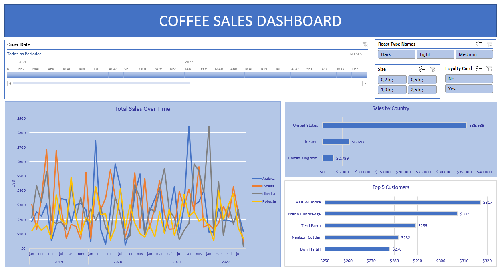

# ☕ Análise de Vendas de Café | Excel Dashboard  

  

## 📌 Sobre o Projeto  
Este projeto tem como objetivo analisar as vendas de café nos **Estados Unidos, Irlanda e Reino Unido**, considerando diferentes tipos de café, torragem e embalagem, além do impacto do cartão fidelidade.  

O foco principal é a **manipulação, limpeza e padronização dos dados** para permitir uma melhor visualização e tomada de decisão através de **dashboards interativos**.  

## 📊 Dados Utilizados  
O conjunto de dados contém informações sobre:  
- **Países:** Estados Unidos, Irlanda e Reino Unido  
- **Tipos de Café:** Arábica, Excelsa, Liberica e Robusta  
- **Tipos de Torragem:** Preto, Médio e Light  
- **Embalagens:** Diferentes formatos e tamanhos  
- **Cartão Fidelidade:** Indicação se a compra foi realizada com ou sem cartão fidelidade  

## 🔄 Etapas do Projeto  

### 1️⃣ Limpeza e Padronização dos Dados  
✔ Remoção de valores duplicados e inconsistentes  
✔ Correção de erros ortográficos nos nomes das regiões e produtos  
✔ Conversão de formatos de data e moeda para padronização  

### 2️⃣ Criação de Tabelas Dinâmicas  
✔ Desenvolvimento de **tabelas dinâmicas** para visualizar as vendas por região  
✔ Cálculo de **KPIs** como vendas total, quantidade vendida e maior consumidores  

### 3️⃣ Desenvolvimento do Dashboard  
✔ Criação de **gráficos dinâmicos** para visualização dos principais insights  
✔ Uso de **segmentações de dados** para facilitar análises específicas   

## 🛠 Ferramentas Utilizadas  
- **Microsoft Excel** para limpeza, padronização e análise dos dados  
- **Tabelas Dinâmicas** para sumarização e exploração dos dados  
- **Dashboards Interativos** para apresentação dos resultados  

---

### 📌 Insights do Projeto  
📍 Identificação dos cafés mais vendidos por país e tipo de torragem  
📍 Análise do impacto do **cartão fidelidade** nas vendas e ticket médio  
📍 Tendências de sazonalidade nas vendas ao longo do tempo  
📍 Produtos mais populares e suas embalagens mais vendidas  

🚀 *Este projeto demonstra como técnicas de análise de dados no Excel podem transformar dados brutos em informações estratégicas para o negócio.*  

