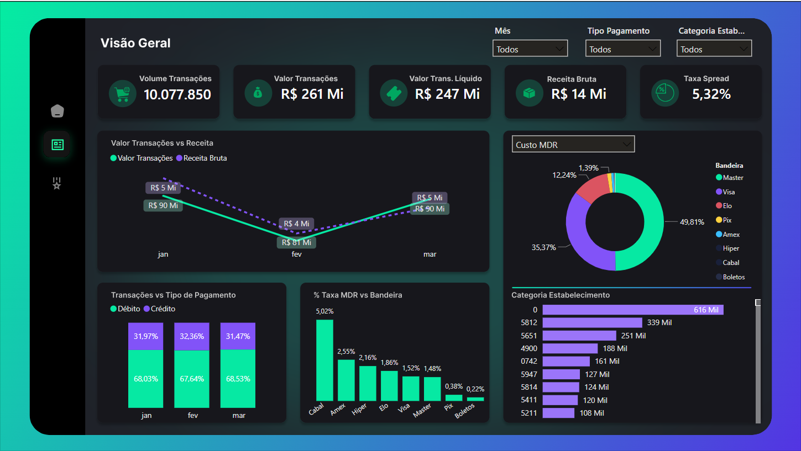
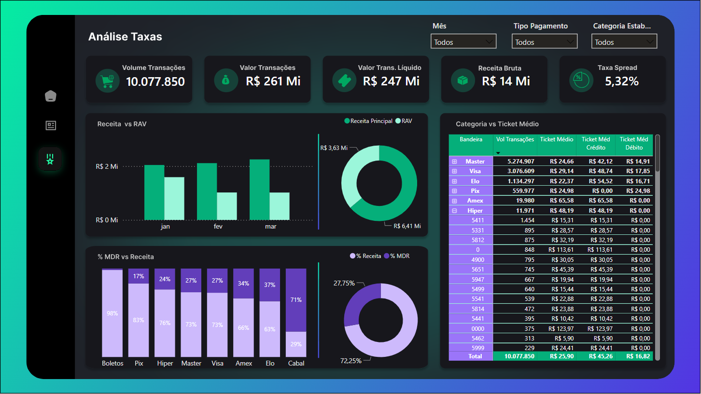

# 📊 Análise de Transações e Receita - Power BI

## 📌 Contexto
A empresa XYZ Pagamentos atua no processamento de transações de cartões de crédito e débito para diferentes categorias de estabelecimentos comerciais. Para otimizar a performance financeira e melhorar a tomada de decisão, foi desenvolvida uma análise exploratória dos dados transacionais.

Os dados analisados abrangem um período de três meses consecutivos e contêm informações sobre parcelamento, tipo de pagamento, bandeira do cartão, categoria do estabelecimento, valores financeiros e taxas aplicadas.

    
    

## 🎯 Objetivo
Criar um dashboard interativo no Power BI que forneça insights sobre a performance das transações, comportamento dos pagamentos e impacto das taxas na receita.

## ❓ Perguntas-Chave
Os principais questionamentos analisados incluem:

1. 📈 **Tendências de Pagamento:** Qual a participação dos pagamentos crédito x débito ao longo dos meses? Há uma mudança no comportamento dos clientes?
2. 💳 **Análise por Bandeira:** Qual a distribuição das transações entre as bandeiras Visa e Master? Alguma delas tem um ticket médio maior?
3. 🏪 **Categorias de Estabelecimento:** Quais categorias de estabelecimento geram maior receita líquida? Alguma categoria apresenta taxas mais elevadas de MDR?
4. 📉 **Impacto das Taxas:** Como o spread e o MDR afetam a receita líquida das transações? Existe alguma correlação entre esses fatores e o valor final recebido pela empresa?
5. 📊 **Evolução Mensal:** O volume de transações e receita cresceu ou caiu ao longo dos três meses analisados? Alguma mudança no comportamento de pagamento foi detectada?

## 🔍 Premissas Consideradas
- 💰 O **Spread** foi considerado como a receita bruta recebida pela empresa.
- 🏦 Empresas que oferecem **RAV (Recebimento Antecipado de Vendas)** permitem que os vendedores recebam pagamentos antecipados, geralmente com taxas de juros.
- 📉 O **MDR (Merchant Discount Rate)** é um custo repassado às bandeiras/bancos e não entra na receita líquida da empresa.
- 📊 A coluna **Receita Bruta** foi considerada como a receita principal da empresa.
- 💵 O **RAV** é uma receita adicional direta da empresa.

## 📢 Principais Descobertas
### 1. 📈 Tendências de Pagamento
- A participação dos pagamentos se manteve estável ao longo dos meses, com aproximadamente **68% para Débito e 32% para Crédito**.
- Não houve indícios de mudança no comportamento dos clientes.

### 2. 💳 Análise por Bandeira
- A distribuição das transações entre as bandeiras foi **52,34% para Mxxr e 30,53% para Vxxa**, representando juntas mais de 80% do mercado.
- Apesar do maior volume da Mxxr, a Vxxa apresentou um **ticket médio superior** (**R$ 29,14 contra R$ 24,66**).

### 3. 🏪 Categorias de Estabelecimento
- A **Categoria 0** gerou a maior receita líquida e volume de transações, além de ter a maior taxa de MDR.
- A **Categoria 4900** teve o segundo maior volume de transações e receita líquida, mas com uma taxa de MDR mais baixa.
- A **Categoria 5812** teve a segunda maior taxa de MDR, ficando atrás apenas da Categoria 0.

### 4. 📉 Impacto das Taxas
- Quanto maior a taxa de MDR, menor a receita líquida da empresa.
- A **bandeira Cxx** apresentou uma taxa de MDR mais alta, retendo **71% do valor do spread recebido**.

### 5. 📊 Evolução Mensal
- O volume de transações e receita caiu em **fevereiro**, possivelmente devido à desaceleração do comércio neste período (**férias e Carnaval**).
- Em **março**, os volumes retornaram aos patamares de janeiro.
- Houve um **alto volume de RAV** realizado pelos clientes em janeiro.

## 📌 Estrutura do Dashboard
O dashboard criado no Power BI inclui:
- 📊 **Visão Geral:** Resumo das transações (quantidade, valor bruto e valor líquido).
- 💳 **Análise de Pagamento:** Comparativo entre pagamentos em crédito e débito.
- 📈 **Distribuição por Bandeira:** Percentual de participação de cada bandeira no total de transações e receita.
- 🏪 **Categorias de Estabelecimento:** Gráficos destacando as categorias mais lucrativas.
- 📆 **Evolução Mensal:** Tendência dos KPIs ao longo dos três meses.
- 📉 **Análise de Taxas:** Relação entre MDR, spread e receita líquida.

## 🚀 Diferenciais Implementados
- 📊 Criação de **medidas DAX** para calcular KPIs dinâmicos (exemplo: ticket médio por categoria, impacto percentual das taxas na receita).
- 🔍 Implementação de **segmentação de dados** para análises filtradas por **mês, tipo de pagamento e categoria de estabelecimento**.
- 📊 Utilização de **gráficos avançados** (linhas, barras empilhadas, matrizes) para melhor visualização dos dados.
- 🎨 Identidade visual alinhada às cores da Captta.

## 🔗 Como Visualizar o Dashboard
Caso queira explorar o dashboard interativo, **clique no link abaixo** para acessá-lo no Power BI Service (se disponível).

🔗 **[Clique aqui para visualizar o dashboard interativo](https://app.powerbi.com/view?r=eyJrIjoiZGFjZThjMzEtNzg2MC00MjE3LTgzZWYtMzQ4NmI3MmM5MzYyIiwidCI6IjFmNWZjOTZjLWYzYzgtNGNlZi05OGRhLWE4MmMwZTNlYzgwYSJ9)**

## 🏁 Conclusão
Este projeto demonstra a capacidade de realizar uma **análise exploratória de transações financeiras** e construir dashboards interativos no **Power BI**, permitindo uma visão clara sobre a performance dos pagamentos e o impacto das taxas na receita.

---

✉ Caso tenha alguma sugestão ou dúvida, fique à vontade para entrar em contato via **[LinkedIn](https://www.linkedin.com/in/leandroschereroliveira/)**! 😊

