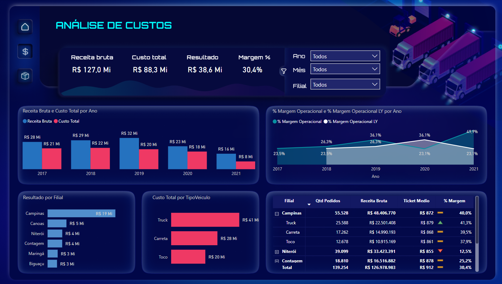
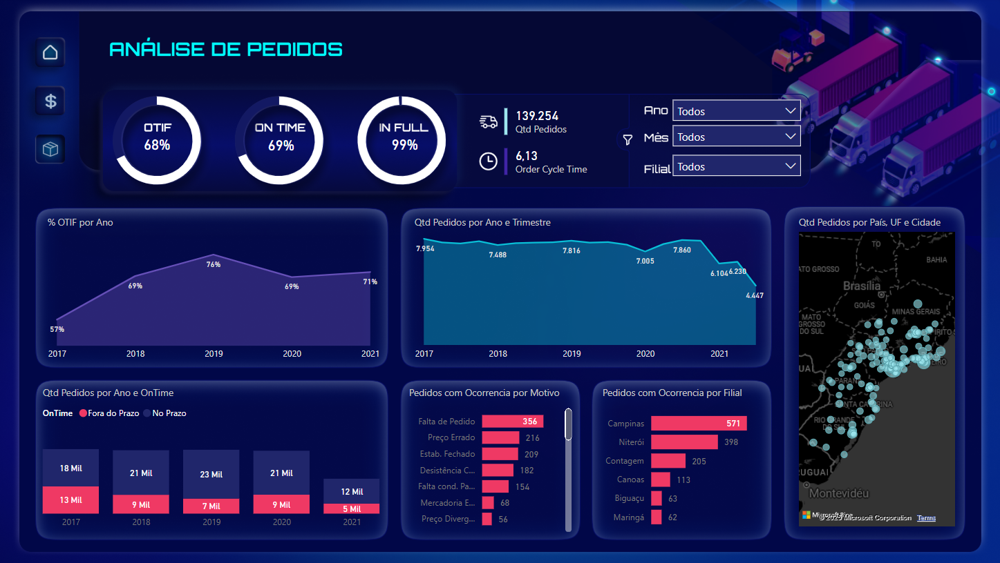
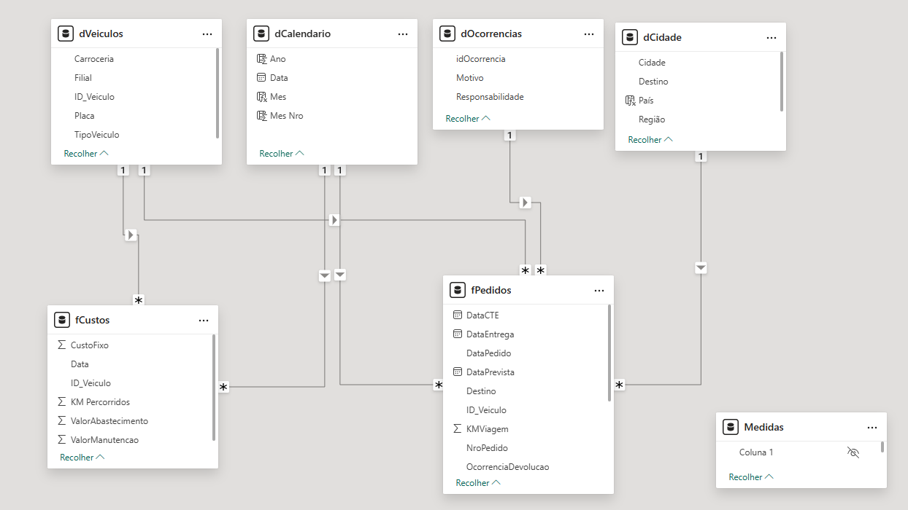

# 🚛 Dashboard de Logística

Este projeto foi desenvolvido durante o **Workshop Power BI para Negócios** da Xperiun. O objetivo foi analisar dados logísticos através da construção de um **dashboard interativo** utilizando **Power BI**.

<div align="center">
    
    
</div>

## 📌 Etapas do Projeto

1️⃣ **ETL (Extração, Transformação e Carregamento)**
- Utilização de **4 arquivos de dados**
- Processamento e limpeza das informações
- Integração e estruturação dos dados para análise

2️⃣ **Modelagem de Dados**
- Estruturação das tabelas em um modelo relacional otimizado



3️⃣ **Criação de Medidas em DAX**

### 🔹 Receita Bruta
```DAX
Receita Bruta = SUM(fPedidos[ValorFrete])
```

### 🔹 % Margem Operacional
```DAX
% Margem Operacional = DIVIDE([Resultado],[Receita Bruta])
```

### 🔹 % Margem Operacional LY
```DAX
% Margem Operacional LY = 
CALCULATE(
    [% Margem Operacional],
    SAMEPERIODLASTYEAR(dCalendario[Data])
)
```

### 🔹 OnTime
```DAX
OnTime = CALCULATE(
    [Qtd Pedidos],
    fPedidos[OnTime] = "No Prazo"
)
```

### 🔹 % InFull
```DAX
% InFull = 
DIVIDE(
    CALCULATE([Qtd Pedidos], fPedidos[OcorrenciaDevolucao] = 0),
    [Qtd Pedidos]
)
```

### 🔹 % OnTime Complementar
```DAX
% OnTime comp = 1 - [% OnTime]
```

---

## 📊 Principais KPIs Analisados

- **InFull** → Percentual de pedidos entregues sem ocorrência
- **OnTime** → Percentual de pedidos entregues dentro do prazo
- **Order Cycle Time (OCT)** → Tempo desde a data do pedido até a entrega
- **Pedidos entregues** → Total de Pedidos que foram entregues
- **Ticket Médio** → Razão entre o Receita Bruta e a Quantidade de Pedidos

Criamos um **dashboard de mapa** para visualizar a rota das entregas:


---

## ❓ Perguntas Respondidas

1️⃣ **Qual a Receita, Custo, Resultado e % Margem Operacional acumulado em todo o período analisado?**  
   - **Receita** = R$ 127,0 Mi  
   - **Custo total** = R$ 88,3 Mi  
   - **Resultado** = R$ 38,6 Mi  
   - **Margem** = 30,4%

2️⃣ **Em 2021, qual o tipo de veículo possui maior % Margem Operacional numa visão geral? E por filial?**  
   - **Truck**. Por filial, também é o tipo **Truck**.

3️⃣ **Em 2021, o ticket médio aumentou em relação à 2020?**  
   - **Sim.**

4️⃣ **Qual a pior e melhor filial em termos de Resultado?**  
   - **Pior**: Biguaçu  
   - **Melhor**: Campinas

5️⃣ **Qual o % On Time em 2021?**  
   - **69,8%**

6️⃣ **Qual o % In Full em 2021?**  
   - **99,1%**

7️⃣ **Qual o % OTIF em 2021? O que um aumento nesse valor representa?**  
   - **68,3%**  
   - O OTIF mede a **satisfação do cliente**. Um aumento nesse valor indica que a empresa está entregando **mais produtos dentro do prazo e com as especificações corretas**.

8️⃣ **Qual a filial com maior quantidade de pedidos devolvidos em todo o período analisado? Essa filial é a pior nesse quesito?**  
   - **Campinas** tem o maior número de devoluções.  
   - **Não é a pior**, pois tem o maior volume de pedidos. A **pior filial** em termos percentuais é **Contagem (1,08%)**.

9️⃣ **Quais os três principais motivos de devolução de mercadorias em 2021?**  
   - **Falta de pedido, Desistência do Cliente e Estabelecimento fechado**.

🔟 **O indicador Order Cycle Time em 2021 melhorou ou piorou em relação ao total dos anos anteriores?**  
   - **Melhorou**: Em 2021, o tempo médio foi **6,05 dias**, enquanto nos anos anteriores foi **6,14 dias**.

---

## 🔗 Acesse o Dashboard Online

📊 **[Clique aqui para visualizar o dashboard interativo](https://app.powerbi.com/view?r=eyJrIjoiMmVhY2ZiMmEtN2NiMi00MDk0LThkMWYtZGNlYjBkNjNjZDM5IiwidCI6IjFmNWZjOTZjLWYzYzgtNGNlZi05OGRhLWE4MmMwZTNlYzgwYSJ9)**

---

## 📩 Contato
Caso tenha dúvidas ou sugestões, entre em contato via **[LinkedIn](https://www.linkedin.com/in/leandroschereroliveira/)**! 😊

🚀 **Este projeto demonstra habilidades em análise de dados logísticos e otimização de entregas no Power BI!**

