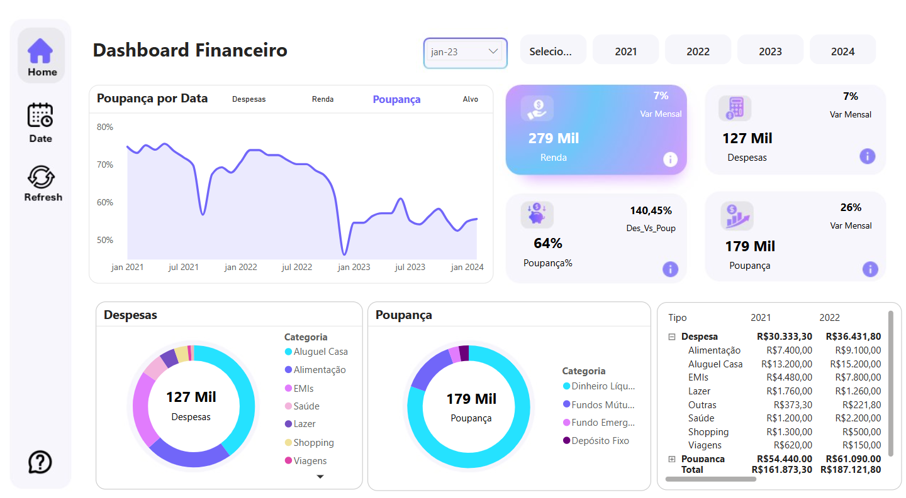
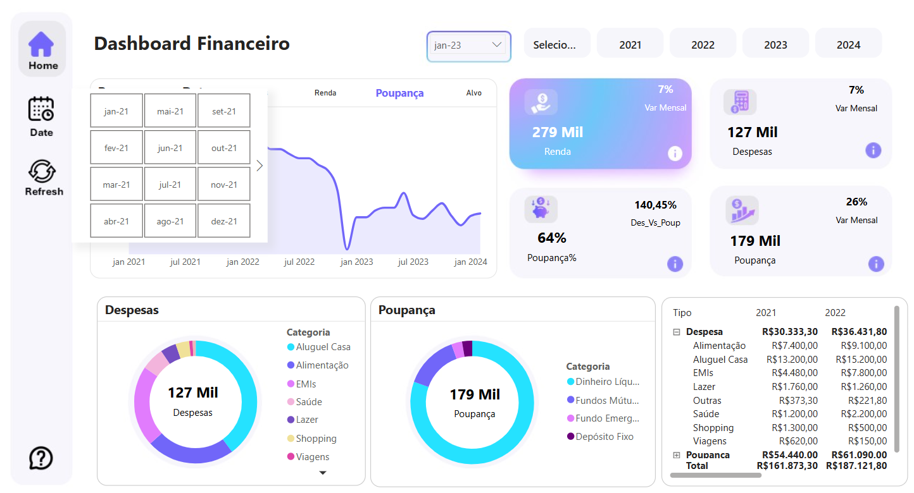
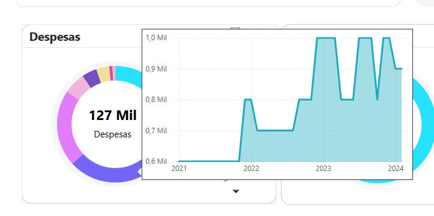

# 📊 Dashboard Financeiro

Este projeto consiste em um **Dashboard Financeiro** desenvolvido no Power BI. O objetivo foi transformar colunas em linhas utilizando a **linguagem M** e criar medidas avançadas em **DAX** para análises detalhadas.

## 🔹 Tecnologias Utilizadas

- 🖥️ **Power BI**
- 🔢 **DAX (Data Analysis Expressions)**
- 📝 **Linguagem M (Power Query)**

## 🎯 Principais Recursos e Técnicas

✔️ Transformação de dados no **Power Query** (colunas para linhas) <br>
✔️ Uso de **medidas DAX avançadas** como:
   - `CONTAINSSTRING`
   - `DATEADD`
   - `DATATABLE`
   - `SELECTEDVALUE`
   - `SWITCH`
   - `SUMMARIZE`
   - `PREVIOUSMONTH`
   - **Título Dinâmico**
   - **Tooltip personalizado**

---

## 📌 Medidas DAX Utilizadas

### 🔹 Despesas
```DAX
Despesas = 
    CALCULATE(
        [Valor_Total], 
        CONTAINSSTRING(f_Base[Tipo], "Despesa")
    )
```

### 🔹 Renda do Último Mês
```DAX
Renda_LM = 
    CALCULATE(
        [Renda],
        DATEADD(
            dCalendario[Date],-1,MONTH
        )
    )
```

### 🔹 Tabela de Seleção de Linhas
```DAX
Linha_Selection_tabela = 
    DATATABLE(
        "Tipo",STRING,"Num",INTEGER,
        {{"Renda",1},{"Poupança",2},{"Despesas",3},{"Alvo",4}}
    )
```

### 🔹 Linha do Gráfico
```DAX
Linha_grafico = 
VAR __sel_valor = SELECTEDVALUE(Linha_Selection_tabela[Num])
```

### 🔹 Título Dinâmico
```DAX
Titulo_dinamico = 
    SELECTEDVALUE(Linha_Selection_tabela[Tipo])&" por Data"
RETURN
SWITCH(__sel_valor,1,[Despesas%],2,[Renda MoM %],3,[Poupança%],4,[Alvo])
```

---

## 📷 Imagens do Dashboard
Dashboard - Visão Geral

Dashboard - Detalhamento da Data

Dashboard - Tooltip <br>


---

🚀 **Este projeto demonstra habilidades em modelagem de dados e criação de KPIs financeiros no Power BI!**
Link do projeto POWERBI online
[Link do projeto POWERBI online](https://app.powerbi.com/view?r=eyJrIjoiN2ViNjBhYzgtYWI4MC00ZmJmLThmZmUtYzRkYWYyNzFiNmRjIiwidCI6IjFmNWZjOTZjLWYzYzgtNGNlZi05OGRhLWE4MmMwZTNlYzgwYSJ9)
